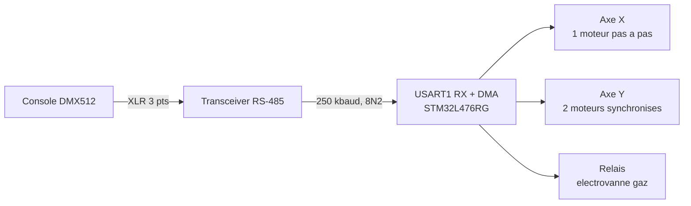

# TISSE FLAMMES

Tête cracheuse de flamme mobile sur portique XY, pilotée en DMX512.
Firmware STM32 Nucleo-L476RG.

<p align="center">
  
</p>

---

## Le projet

Un projecteur à flammes classique est constitué d'une matrice de têtes cracheuses
**fixes**. Cette machine pose les bases d'un démonstrateur qui n'en comporte
qu'une seule, **mobile**, déplacée par un robot cartésien. Les durites
d'alimentation en combustible cheminent dans la chaîne porte-câble, et la machine
est disposée de telle sorte que le public soit face au plan XY : la flamme dessine
alors sa trajectoire dans ce plan.

L'électronique n'a que trois commandes élémentaires à assurer — déplacement sur X,
déplacement sur Y, ignition / extinction — mais elle doit faire l'interface entre
une commande **lente**, celle du pupitre DMX, et un pilotage des moteurs beaucoup
plus **rapide**.

**Caractéristiques visées**

| | |
|---|---|
| Taille du cadre | 600 × 600 mm |
| Vitesse maximale par axe | 1 m/s |
| Accélération maximale par axe | 10 m/s² |

Le sujet se décompose en deux volets : la **conception mécanique** (choix des axes,
des moteurs, de la connectique, acheminement du gaz jusqu'à la tête) et la
**conception électronique** (interface DMX vers le pilotage des actionneurs,
sécurité flamme, pilotage des moteurs). Ce dépôt couvre le second.

**Contexte** — projet TER du Master 1 SME (Systèmes et Microsystèmes Embarqués),
Université Toulouse III Paul Sabatier, 2025–2026. Encadrant : M. Chabert.
Partenaire : Rêves de Feu.

---

## Architecture



| Élément | Choix |
|---|---|
| Microcontrôleur | STM32L476RGT6 (Nucleo-64), Cortex-M4 @ 80 MHz |
| Liaison de commande | DMX512 — USART1 en réception, 250 kbaud, 8 bits, 2 stops, sans parité |
| Axe X | 1 moteur pas à pas, commande STEP / DIR |
| Axe Y | 2 moteurs pas à pas synchronisés, directions opposées |
| Allumage | sortie relais pour l'électrovanne de gaz |

---

## Commande DMX

La machine occupe **3 canaux** consécutifs à partir de son adresse de base.

| Canal | Fonction | Valeurs |
|---|---|---|
| 1 | Dimmer / sécurité | `0` : flamme coupée · `1–150` : témoin LD2 allumé, portique figé · `> 150` : déplacements autorisés |
| 2 | Position X | `0` à `255`, mis à l'échelle sur la course totale |
| 3 | Position Y | `0` à `255`, mis à l'échelle sur la course totale |

Le seuil de 150 sur le canal 1 est volontairement haut : un pupitre au repos, un
câble débranché ou une trame corrompue laissent la valeur sous le seuil, et la
machine ne bouge pas.

> Dans le code, `canal[]` contient la trame DMX brute : `canal[0]` est le
> *start code*, donc `canal[1]` correspond bien au canal DMX 1.

---

## Brochage

| Broche | Label | Fonction |
|---|---|---|
| PA9 / PA10 | USART1_TX / USART1_RX | liaison DMX (seule la réception est utilisée) |
| PA0 / PA1 | `DIR_PIN` / `STEP_PIN` | axe X |
| PA7 / PB4 | `DIR_PIN_Y1` / `STEP_PIN_Y1` | moteur Y1 |
| PC7 / PB10 | `DIR_PIN_Y2` / `STEP_PIN_Y2` | moteur Y2, direction inversée par rapport à Y1 |
| PC1 | `RELAI_8` | commande relais électrovanne |
| PA5 | `LD2` | LED verte de la Nucleo, témoin de réception DMX |
| PC13 | `B1` | bouton bleu de la Nucleo (EXTI) |

---

## Réception DMX

Une trame DMX512 arrive toutes les ~23 ms et transporte jusqu'à 512 octets. La
traiter caractère par caractère saturerait le cœur pour rien : le tableau `canal[]`
(513 octets) est donc rempli par **DMA en mode circulaire**, sans intervention du
CPU, et la boucle principale se contente de lire les cases qui l'intéressent.

Reste la synchronisation. Rien ne marque le début d'une trame dans les données
elles-mêmes — le séparateur est un **BREAK**, une ligne maintenue à l'état bas plus
longtemps qu'un caractère, que l'UART signale comme une **erreur de trame**. Le
firmware s'en sert comme signal de départ :

```c
void USART1_IRQHandler(void) {
    if (USART1->ISR & USART_ISR_FE) {   // BREAK detecte = debut de trame
        USART1->ICR = USART_ICR_FECF;
        reset_dma();                     // on repositionne le DMA sur canal[0]
    }
    ...
}
```

`reset_dma()` agit directement sur les registres du DMA plutôt que par la HAL :
désactivation du canal, `CNDTR` rechargé à 513, adresse mémoire forcée, réactivation.
L'opération doit être terminée avant l'arrivée du premier octet de la trame.

---

## Arborescence

```
TISSE_FLAMMES/
├── Firmware/            projet STM32CubeIDE
│   ├── Core/Src/
│   │   ├── main.c       boucle de controle, mise a l'echelle DMX -> pas
│   │   ├── usart.c      DMX : dmx_start(), reset_dma(), ISR
│   │   ├── tim.c        TIM6
│   │   ├── dma.c        horloge et interruptions DMA1
│   │   └── gpio.c       configuration des broches
│   ├── Drivers/         HAL STM32L4 et CMSIS
│   └── TISSE_FLAMMES.ioc
├── Docs/                rapport et documents du projet
└── Images/              photos de la machine
```

---

## Compiler et flasher

1. STM32CubeIDE → *File* → *Import* → *Existing Projects into Workspace*
2. Sélectionner le dossier `Firmware/`
3. *Build All*, puis *Run* avec la Nucleo branchée en USB

Le `.ioc` s'ouvre dans STM32CubeMX ; la régénération du code préserve les blocs
`USER CODE BEGIN/END`.

---

## Évolutions prévues

Le cahier des charges envisage l'ajout de têtes supplémentaires le long de l'axe Z.
Il faudra alors empêcher la flamme d'une tête d'endommager celle placée derrière
elle, par exemple en éteignant la tête postérieure lorsque la distance en X et Y
devient trop faible. La compatibilité électromagnétique sera également un sujet à
part entière : les étincelles haute tension / haute fréquence de l'allumage
cohabitent avec le pilotage des moteurs et des électrovannes.

---

**Alexandre Aragones** — M1 SME, Université Toulouse III Paul Sabatier, 2025–2026.
