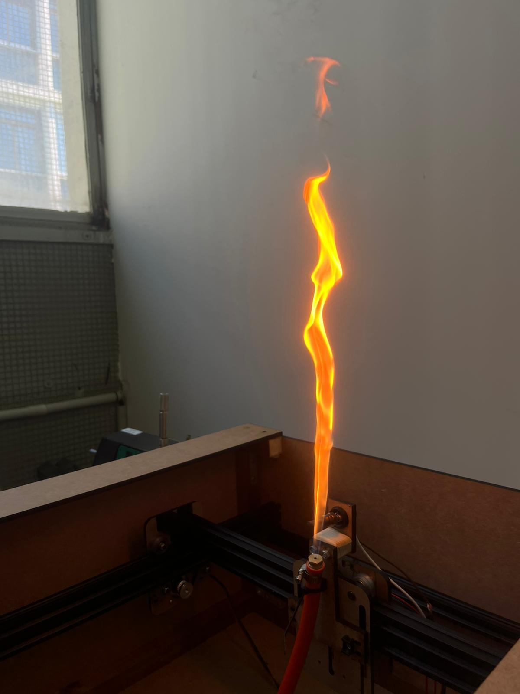
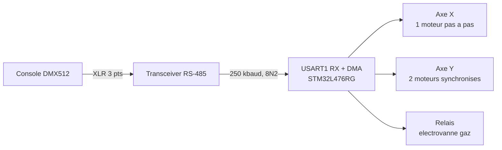

# TISSE FLAMMES

Portique XY à flamme piloté en DMX512, sur STM32 Nucleo-L476RG.

Une buse de gaz montée sur un chariot deux axes se déplace le long d'un portique
pendant que la flamme brûle : la flamme « tisse » une trajectoire dans l'air.
Position et allumage sont commandés depuis une console lumière standard, sur les
mêmes câbles DMX que le reste d'un spectacle.

<p align="center">
  
</p>

---

## Contexte

Projet **TER** (Travail d'Étude et de Recherche) du **Master 1 SME** — Systèmes et
Microsystèmes Embarqués, Université Toulouse III Paul Sabatier, année 2025–2026.

* Encadrant : **M. Chabert**
* Partenaire : **Rêves de Feu** (machines à flammes pour le spectacle)

L'objectif est de rendre une machine à flammes *adressable* : au lieu d'un simple
déclenchement tout-ou-rien, la machine reçoit une position continue et s'intègre
au pupitre du régisseur comme n'importe quel projecteur.

---

## Le système



| Élément | Choix |
|---|---|
| Microcontrôleur | STM32L476RGT6 (carte Nucleo-64), Cortex-M4 @ 80 MHz |
| Liaison de commande | DMX512 — USART1 en réception, 250 kbaud, 8 bits, 2 stops, sans parité |
| Axe X | 1 moteur pas à pas, commande STEP / DIR |
| Axe Y | 2 moteurs pas à pas synchronisés, directions opposées (chariot guidé des deux côtés) |
| Allumage | sortie relais pour l'électrovanne de gaz |
| Base de temps | TIM6, compteur libre 16 bits (voir *Points à reprendre*) |

La course totale d'un axe est fixée dans le firmware par `COURSE_MAX = 2000` pas.

---

## Patch DMX

La machine occupe **3 canaux** consécutifs à partir de son adresse de base.

| Canal | Fonction | Valeurs |
|---|---|---|
| 1 | Dimmer / sécurité | `0` : flamme coupée · `1–150` : témoin LD2 allumé, portique figé · `> 150` : déplacements autorisés |
| 2 | Position X | `0` à `255`, mis à l'échelle sur la course totale |
| 3 | Position Y | `0` à `255`, mis à l'échelle sur la course totale |

Le seuil de 150 sur le canal 1 est volontairement haut : un pupitre au repos, un
câble débranché ou une trame corrompue laissent la valeur sous le seuil, et le
portique ne bouge pas.

> Dans le code, le tableau `canal[]` contient la trame DMX brute : `canal[0]` est
> le *start code* (0x00 pour une trame de données), donc `canal[1]` correspond bien
> au canal DMX 1.

---

## Brochage

| Broche | Label | Fonction |
|---|---|---|
| PA9 / PA10 | USART1_TX / USART1_RX | liaison DMX (seule la réception est utilisée) |
| PA0 | `DIR_PIN` | direction axe X |
| PA1 | `STEP_PIN` | impulsions axe X |
| PA7 | `DIR_PIN_Y1` | direction moteur Y1 |
| PB4 | `STEP_PIN_Y1` | impulsions moteur Y1 |
| PC7 | `DIR_PIN_Y2` | direction moteur Y2 (inversée par rapport à Y1) |
| PB10 | `STEP_PIN_Y2` | impulsions moteur Y2 |
| PC1 | `RELAI_8` | commande relais électrovanne |
| PA5 | `LD2` | LED verte de la Nucleo, témoin de réception DMX |
| PC13 | `B1` | bouton bleu de la Nucleo (EXTI) |

---

## Réception DMX : le point technique du projet

Une trame DMX512 arrive toutes les ~23 ms et transporte jusqu'à 512 octets. La
traiter par interruption caractère par caractère saturerait le cœur pour rien.
Le firmware utilise donc le **DMA en mode circulaire** : le tableau `canal[]`
(513 octets) est rempli en tâche de fond, sans aucune intervention du CPU, et la
boucle principale se contente de lire les cases qui l'intéressent.

Reste le problème de la synchronisation. Rien ne marque le début d'une trame DMX
dans les données elles-mêmes — le séparateur est un **BREAK**, c'est-à-dire une
ligne maintenue à l'état bas plus longtemps qu'un caractère. L'UART le signale
comme une **erreur de trame** (*framing error*). Le firmware s'en sert comme
signal de départ :

```c
void USART1_IRQHandler(void) {
    if (USART1->ISR & USART_ISR_FE) {   // BREAK detecte = debut de trame
        USART1->ICR = USART_ICR_FECF;
        reset_dma();                     // on repositionne le DMA sur canal[0]
    }
    ...
}
```

`reset_dma()` agit directement sur les registres du DMA plutôt que par la HAL :
désactivation du canal, `CNDTR` rechargé à 513, adresse mémoire forcée, puis
réactivation. L'opération tient en quelques cycles, ce qui est nécessaire pour
être terminé avant l'arrivée du premier octet de la trame.

Un filet de sécurité complète le dispositif : si un *overrun* survient malgré
tout, il est détecté dans l'interruption **et** dans la boucle principale, qui
relance alors une réception propre via `dmx_start()`.

---

## Arborescence

```
TISSE_FLAMMES/
├── Firmware/            projet STM32CubeIDE
│   ├── Core/
│   │   ├── Inc/         en-tetes (main, usart, tim, dma, gpio)
│   │   └── Src/
│   │       ├── main.c   boucle de controle, mise a l'echelle DMX -> pas
│   │       ├── usart.c  DMX : init UART, dmx_start(), reset_dma(), ISR
│   │       ├── tim.c    TIM6, compteur libre pour delay_us()
│   │       ├── dma.c    horloge et interruptions DMA1
│   │       └── gpio.c   configuration des broches
│   ├── Drivers/         HAL STM32L4 et CMSIS
│   └── TISSE_FLAMMES.ioc   configuration STM32CubeMX
├── Docs/                rapport et documents du projet
└── Images/              photos de la machine
```

---

## Compiler et flasher

1. STM32CubeIDE → *File* → *Import* → *Existing Projects into Workspace*
2. Sélectionner le dossier `Firmware/` de ce dépôt
3. *Project* → *Build All*, puis *Run* avec la Nucleo branchée en USB

Le fichier `.ioc` s'ouvre directement dans STM32CubeMX pour modifier la
configuration ; la régénération du code préserve les blocs `USER CODE BEGIN/END`.

---

## Sécurité

Le gaz impose des garde-fous qui ne sont pas négociables :

* le portique ne se déplace que si le canal 1 dépasse 150 ;
* toute erreur de réception DMX provoque une resynchronisation, jamais une
  interprétation de données douteuses ;
* la LED LD2 donne un retour visuel immédiat de l'état du dimmer, sans avoir à
  s'approcher de la machine.

---

## Points à reprendre

| Point | Conséquence | Piste |
|---|---|---|
| `deplacement_X/Y()` bloquant (`HAL_Delay(2)` par demi-pas) | un déplacement pleine course dure ~8 s, pendant lesquelles les nouvelles valeurs DMX ne sont pas prises en compte | générer les pas par timer et interruption, ou par PWM sur la broche STEP |
| Pas de rampe d'accélération | perte de pas possible sur les grands déplacements | profil trapézoïdal en accélération / vitesse constante / décélération |
| `RELAI_8` déclaré mais jamais commandé dans la boucle | l'électrovanne n'est pas encore pilotée depuis le DMX | lier le relais au canal 1 avec une temporisation d'allumage |
| Pas de prise d'origine | la position de départ est supposée être 0 | fins de course sur chaque axe et séquence de *homing* à la mise sous tension |
| `delay_us()` ne délivre pas des microsecondes | TIM6 a `PSC = 0`, donc il compte à 80 MHz : un « tick » vaut 12,5 ns et l'attente est 80 fois trop courte | mettre `PSC = 79` pour retrouver 1 tick = 1 µs (la fonction n'est pas utilisée aujourd'hui, mais elle le sera dès que les pas seront générés finement) |
| PA2 / PA3 configurés en USART2 sans initialisation | reliquat de la configuration Nucleo par défaut | à retirer du `.ioc` ou à utiliser comme console de debug |

---

## Auteur

**Alexandre Aragones** — M1 SME, Université Toulouse III Paul Sabatier, 2025–2026.
